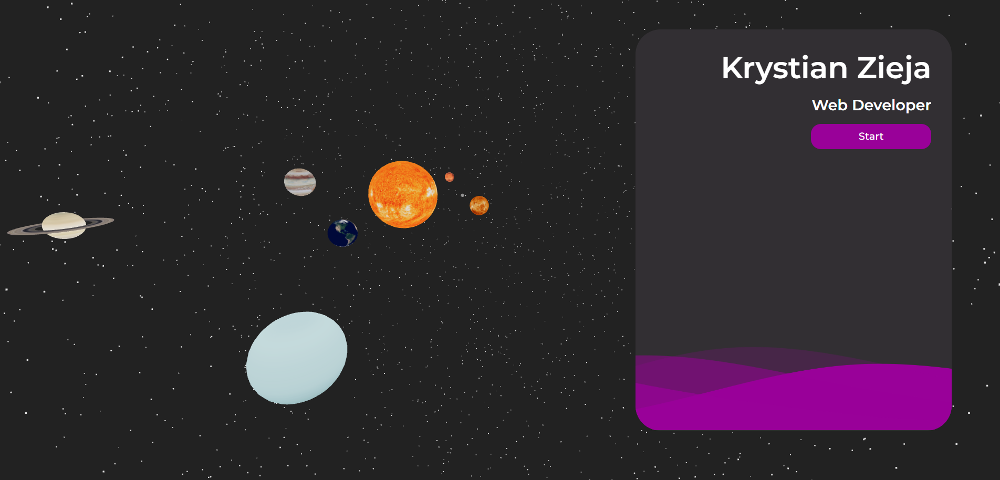
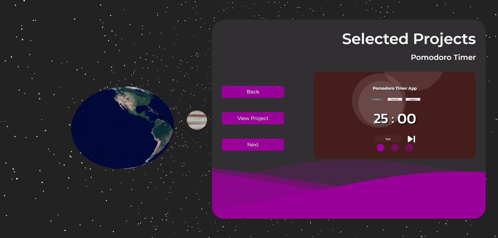

<h2>Portfolio Website made using 3D libraries !!!</h2>

<h3>Screenshots:</h3>

 

<h3>Technologies :</h3>

<ul>
    <li>React</li>
    <li>THREE.js</li>
    <li>React-Three-Fiber</li>
    <li>GSAP</li>
    <li>SCSS</li>
</ul>

<h3>Project Setup:</h3>

<ul>
    <li>Download or clone repo</li>
    <li>Open project in terminal and run "npm install" or "yarn add"</li>
    <li>Use "npm run start" or "yarn start"</li>
</ul>